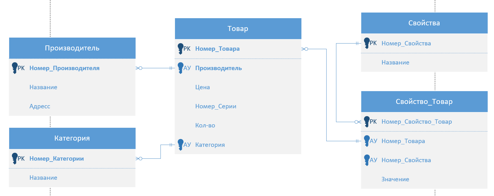

# Магазин Комьютерной Техники

Выполнил Рузанов Антон Сергеевич в рамках тестового задания для компании EasyBot

#### Диаграмма Crow's Foot

## Компиляция
1. Перейти в папку проекта и запустить ``./mvnw package``
2. Скомпилированный файл ``PC-Store-1.0.0-SNAPSHOT.jar`` будет находиться в папке ``target``

## Запуск
#### Если была выполнена компиляция, то
> 1. Перейти в папку ``cd target``
> 2. Запустить приложение ``java -jar PC-Store-1.0.0-SNAPSHOT.jar``
#### Так же можно скачать файл
> [Отсюда](https://github.com/AaronR92/PC-Store/releases)   
> И сразу запустить его из папки, в которую он был скачан ``java -jar PC-Store-1.0.0-SNAPSHOT.jar``

## Конфигурация
* Для отключения отображения sql-запросов в консоли 
в файле конфигурации ``application.yml`` изменить значение ``spring.jpa.show-sql`` на ``false``
* По умолчанию в приложении включена панель бд - путь ``localhost:8080/h2``